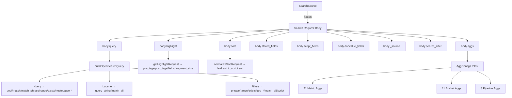

# OpenSearch Dashboards — Core Search Infrastructure Analysis

## Executive Summary

This document provides an exhaustive analysis of the OpenSearch Dashboards core search infrastructure, covering DSL query construction, aggregation types, filter builders, highlight usage, scripting, and server-side client capabilities. The analysis covers six key areas of the codebase.

---

## 1. SearchSource (`src/plugins/data/common/search/search_source/`)

### How Queries Are Built

The `SearchSource` class is a hierarchical, promise-based search builder. It uses an inheritance chain where child search sources inherit from parent sources. The `flatten()` method walks the chain and merges all fields into a single search request body.

### DSL Body Fields Constructed in `flatten()`

| Body Field | Source |
|---|---|
| `body.query` | Built via `buildOpenSearchQuery()` — produces a top-level `bool` query |
| `body.highlight` | Built via `getHighlightRequest()` when `highlightAll` is true |
| `body.sort` | Built via `normalizeSortRequest()` |
| `body.stored_fields` | From `index.getComputedFields().storedFields` |
| `body.script_fields` | From `index.getComputedFields().scriptFields` + merged |
| `body.docvalue_fields` | From `index.getComputedFields().docvalueFields` |
| `body._source` | From `index.getSourceFiltering()` or explicit `source` field |
| `body.search_after` | From `searchAfter` field on SearchSource |
| `body.fields` | Set to `['*']` when `SEARCH_INCLUDE_ALL_FIELDS` is enabled |

### SearchSourceFields (all settable properties)

- `type` — index type
- `query` — Query object (language + query string)
- `filter` — Filter or Filter[] or function returning filters
- `sort` — OpenSearchQuerySortValue or array
- `highlight` / `highlightAll` — highlight configuration
- `aggs` — AggConfigs
- `from` / `size` — pagination
- `source` — `_source` filtering (NameList)
- `version` — return document version
- `fields` — specific fields to return
- `index` — IndexPattern / DataView
- `searchAfter` — `search_after` cursor `[string|number, string|number]`
- `timeout` — search timeout
- `terminate_after` — max docs to collect per shard
- `df` — IDataFrame
- `skipTimeFilter` — skip time filter

### Sort Handling (`normalizeSortRequest`)

- Standard field sort: `{ fieldName: { order: 'asc'|'desc', ...defaultSortOptions } }`
- Scripted field sort: `{ _script: { script: { source, lang }, type: 'number'|'string', order } }`
- Sort options supported: `mode` (min/max/sum/avg/median), `type`, `nested`, `unmapped_type`, `distance_type`, `unit`, `ignore_unmapped`, `_script`
- `_score` sort excludes `unmapped_type`

---

## 2. Aggregation Types (`src/plugins/data/common/search/aggs/`)

### Metric Aggregations (21 registered)

| Enum Name | DSL Agg Type | Category |
|---|---|---|
| `count` | (no DSL agg — uses `doc_count`) | Basic Metric |
| `avg` | `avg` | Basic Metric |
| `sum` | `sum` | Basic Metric |
| `median` | `percentiles` (with `percents: [50]`) | Basic Metric |
| `min` | `min` | Basic Metric |
| `max` | `max` | Basic Metric |
| `std_dev` | `extended_stats` | Basic Metric |
| `cardinality` | `cardinality` | Basic Metric |
| `percentiles` | `percentiles` | Basic Metric |
| `percentile_ranks` | `percentile_ranks` | Basic Metric |
| `top_hits` | `top_hits` | Basic Metric |
| `geo_bounds` | `geo_bounds` | Geo Metric |
| `geo_centroid` | `geo_centroid` | Geo Metric |
| `derivative` | `derivative` | Parent Pipeline |
| `cumulative_sum` | `cumulative_sum` | Parent Pipeline |
| `moving_avg` | `moving_avg` / `moving_fn` | Parent Pipeline |
| `serial_diff` | `serial_diff` | Parent Pipeline |
| `avg_bucket` | `avg_bucket` | Sibling Pipeline |
| `sum_bucket` | `sum_bucket` | Sibling Pipeline |
| `min_bucket` | `min_bucket` | Sibling Pipeline |
| `max_bucket` | `max_bucket` | Sibling Pipeline |

### Bucket Aggregations (11 registered)

| Enum Name | DSL Agg Type |
|---|---|
| `date_histogram` | `date_histogram` |
| `histogram` | `histogram` |
| `range` | `range` |
| `date_range` | `date_range` |
| `ip_range` | `ip_range` |
| `terms` | `terms` |
| `filter` | `filter` |
| `filters` | `filters` |
| `significant_terms` | `significant_terms` |
| `geohash_grid` | `geohash_grid` |
| `geotile_grid` | `geotile_grid` |

### Additional Internal Bucket (not in registry)

- `shard_delay` — used for testing, produces `shard_delay` agg with a `value` param

### Pipeline Aggregation Details

**Parent Pipeline Aggs** (operate on parent agg's buckets):
- `derivative` — `buckets_path` references parent metric
- `cumulative_sum` — `buckets_path` references parent metric
- `moving_avg` — `buckets_path`, `window`, `model` (linear/simple/ewma/holt/holt_winters), `settings`
- `serial_diff` — `buckets_path`, `lag`

**Sibling Pipeline Aggs** (operate on sibling agg's buckets):
- `avg_bucket` — `buckets_path` references sibling
- `sum_bucket` — `buckets_path` references sibling
- `min_bucket` — `buckets_path` references sibling
- `max_bucket` — `buckets_path` references sibling

### Top Hits Agg — Special DSL Features Used

- `_source` — field name or `true`
- `script_fields` — for scripted fields `{ [name]: { script: { source, lang } } }`
- `docvalue_fields` — `[{ field, format? }]` (format `date_time` for date fields)
- `sort` — standard or `_script` sort
- `size` — number of top hits to return

### Terms Agg — Special DSL Features Used

- `order` — `{ _count: dir }` or `{ aggId: dir }`
- `value_type` — `'float'` or field type (for scripted fields)
- `missing` — `'__missing__'` for missing bucket support
- `include` / `exclude` — regex patterns for term filtering
- Other bucket uses `filters` agg with `bool` + `must_not` + `match_phrase` construction

### GeoHash Agg — Special DSL Features Used

- Wraps itself in a `filter` agg with `geo_bounding_box` when `isFilteredByCollar` is true
- Adds `geo_centroid` sub-aggregation when `useGeocentroid` is true

---

## 3. Query Builders & Filters (`src/plugins/data/common/opensearch_query/`)

### Top-Level Query Construction (`buildOpenSearchQuery`)

Produces a `bool` query with `must`, `filter`, `should`, `must_not` arrays, merging:
1. **Kuery queries** → `buildQueryFromKuery()`
2. **Lucene queries** → `buildQueryFromLucene()`
3. **Filters** → `buildQueryFromFilters()`

For unsupported query languages, returns `{ type: 'unsupported', queries, filters }`.

### DSL Query Types Constructed by Kuery Functions

| Kuery Function | DSL Query Types Produced |
|---|---|
| `is` (field:value) | `match`, `match_phrase`, `multi_match`, `query_string`, `range` (for dates), `exists`, `match_all`, `script` (for scripted fields) |
| `range` | `range`, `script` (for scripted fields) |
| `exists` | `exists` |
| `and` | `bool.filter` |
| `or` | `bool.should` + `minimum_should_match: 1` |
| `not` | `bool.must_not` |
| `nested` | `nested` (with `path`, `query`, `score_mode: 'none'`) |
| `geo_bounding_box` | `geo_bounding_box` (with `ignore_unmapped: true`) |
| `geo_polygon` | `geo_polygon` (with `ignore_unmapped: true`) |

### DSL Query Types from Lucene Path

| Input | DSL Query Type |
|---|---|
| Empty string | `match_all` |
| Non-empty string | `query_string` (with `time_zone`, `analyze_wildcard`, and other `queryStringOptions`) |

### Filter Types (all defined in `opensearch_query/filters/`)

| Filter Type | DSL Construct | FILTERS Enum |
|---|---|---|
| **PhraseFilter** | `match_phrase` or `script` (scripted fields) | `PHRASE` |
| **PhrasesFilter** | `bool.should` of `match_phrase` entries | `PHRASES` |
| **RangeFilter** | `range` or `script` (scripted fields) or `match_all` (infinite range) | `RANGE` |
| **ExistsFilter** | `exists` | `EXISTS` |
| **GeoBoundingBoxFilter** | `geo_bounding_box` | `GEO_BOUNDING_BOX` |
| **GeoPolygonFilter** | `geo_polygon` | `GEO_POLYGON` |
| **GeoShapeFilter** | `geo_shape` (Polygon, MultiPolygon, PreIndexedShape) | `GEO_SHAPE` |
| **MatchAllFilter** | `match_all` | `MATCH_ALL` |
| **MissingFilter** | `missing` | `MISSING` |
| **QueryStringFilter** | `query_string` | `QUERY_STRING` |
| **CustomFilter** | arbitrary DSL | `CUSTOM` |
| **SpatialFilter** | (enum only) | `SPATIAL_FILTER` |

### DSL Query Types in `opensearch_query_dsl.ts` Type Definitions

- `DslRangeQuery` — `range`
- `DslMatchQuery` — `match`
- `DslQueryStringQuery` — `query_string`
- `DslMatchAllQuery` — `match_all`
- `DslTermQuery` — `term`

### Nested Filter Handling

`handleNestedFilter()` wraps filters in a `nested` query when the field has `subType.nested.path`.

### Filter Migration

`migrateFilter()` converts deprecated `match` with `type: 'phrase'` to `match_phrase`.

---

## 4. Highlight Usage (`src/plugins/data/common/field_formats/utils/highlight/`)

### Highlight Request Construction (`getHighlightRequest`)

When `doc_table:highlight` UI setting is enabled:

```json
{
  "pre_tags": ["@opensearch-dashboards-highlighted-field@"],
  "post_tags": ["@/opensearch-dashboards-highlighted-field@"],
  "fields": { "*": {} },
  "fragment_size": 2147483647
}
```

- Uses custom pre/post tags (not default `<em>`) to avoid conflicts with field values
- `fragment_size` is set to `Integer.MAX_VALUE` (2^31 - 1) to return full field content
- Highlights ALL fields (`"*": {}`)
- No explicit `type` specified (uses OpenSearch default — `unified` highlighter)

### Highlight HTML Rendering (`getHighlightHtml`)

- Replaces custom highlight tags with `<mark>` / `</mark>` HTML tags
- Escapes HTML in field values before replacement

### Highlight Display Component (`parseHighlightedValue`)

- React component that parses highlight tags into `<mark>` React elements
- `getDisplayValue()` checks for highlight fragments and falls back to formatted value

---

## 5. Constants (`src/plugins/data/common/constants.ts`)

### DSL-Related UI_SETTINGS Constants

| Constant | Setting Key | DSL Impact |
|---|---|---|
| `DOC_HIGHLIGHT` | `doc_table:highlight` | Controls whether `highlight` is added to search body |
| `QUERY_STRING_OPTIONS` | `query:queryString:options` | Passed to `query_string` DSL (e.g., `analyze_wildcard`) |
| `QUERY_ALLOW_LEADING_WILDCARDS` | `query:allowLeadingWildcards` | Kuery parser option |
| `SORT_OPTIONS` | `sort:options` | Default sort options (`unmapped_type`, etc.) |
| `COURIER_MAX_CONCURRENT_SHARD_REQUESTS` | `courier:maxConcurrentShardRequests` | `max_concurrent_shard_requests` param |
| `COURIER_SET_REQUEST_PREFERENCE` | `courier:setRequestPreference` | `preference` param (`sessionId` or custom) |
| `COURIER_BATCH_SEARCHES` | `courier:batchSearches` | Enables legacy batch/msearch |
| `SEARCH_INCLUDE_FROZEN` | `search:includeFrozen` | `ignore_throttled` param |
| `SEARCH_TIMEOUT` | `search:timeout` | `timeout` param |
| `SEARCH_INCLUDE_ALL_FIELDS` | `search:includeAllFields` | Sets `body.fields = ['*']` |
| `META_FIELDS` | `metaFields` | Fields excluded from `_source` filtering |
| `HISTOGRAM_BAR_TARGET` | `histogram:barTarget` | Histogram agg interval calculation |
| `HISTOGRAM_MAX_BARS` | `histogram:maxBars` | Histogram agg max buckets |
| `COURIER_IGNORE_FILTER_IF_FIELD_NOT_IN_INDEX` | `courier:ignoreFilterIfFieldNotInIndex` | Filter-to-query conversion |
| `DATE_FORMAT_TIMEZONE` | `dateFormat:tz` | `time_zone` in `query_string` and `range` queries |

---

## 6. Server-Side OpenSearch Client (`src/core/server/opensearch/`)

### Modern Client (`client/`)

- `OpenSearchClient` type wraps `@opensearch-project/opensearch` `OpenSearchDashboardsClient`
- Exposes `transport.request()` for arbitrary API calls
- `ClusterClient` creates internal and scoped clients with header forwarding

### SearchResponse Type Fields (from `client/types.ts`)

The typed `SearchResponse<T>` includes:
- `_scroll_id` — scroll context ID
- `hits.hits[].highlight` — highlight fragments
- `hits.hits[].inner_hits` — inner hits from nested/parent-child queries
- `hits.hits[].fields` — stored fields / docvalue fields
- `hits.hits[].sort` — sort values (for `search_after`)
- `hits.hits[]._source` — source document
- `hits.hits[]._explanation` — explain output
- `hits.hits[].matched_queries` — named query matches
- `aggregations` — aggregation results

### CountResponse Type

- `count` — document count
- `_shards` — shard info

### Legacy Client API (`legacy/api_types.ts`)

The `LegacyAPICaller` interface exposes typed endpoints for ALL OpenSearch operations:

**Search-related endpoints:**
- `search` — `SearchParams` (supports all search body options)
- `scroll` — `ScrollParams` (scroll continuation)
- `clearScroll` — `ClearScrollParams`
- `count` — `CountParams` (`_count` API)
- `msearch` — `MSearchParams` (multi-search)
- `msearchTemplate` — `MSearchTemplateParams`
- `searchTemplate` — `SearchTemplateParams`
- `searchShards` — `SearchShardsParams`
- `suggest` — `SuggestParams`
- `explain` — `ExplainParams`
- `fieldStats` — `FieldStatsParams`

**Document endpoints:**
- `get`, `mget`, `index`, `create`, `update`, `delete`, `deleteByQuery`, `updateByQuery`, `bulk`, `reindex`

**Script endpoints:**
- `getScript`, `putScript`, `deleteScript`
- `getTemplate`, `putTemplate`, `deleteTemplate`, `renderSearchTemplate`

---

## Complete DSL Query Types Constructed

### Query Types

| DSL Query Type | Where Constructed |
|---|---|
| `bool` | `buildOpenSearchQuery`, kuery `and`/`or`/`not`/`is`, `buildPhrasesFilter` |
| `match` | kuery `is` (best_fields type) |
| `match_phrase` | kuery `is` (phrase type), `buildPhraseFilter`, `migrateFilter`, `_terms_other_bucket_helper` |
| `match_all` | `luceneStringToDsl` (empty string), kuery `is` (wildcard `*` on all fields), `buildRangeFilter` (infinite range) |
| `multi_match` | kuery `is` (no field specified, `type: 'phrase'` or `'best_fields'`) |
| `query_string` | `luceneStringToDsl`, kuery `is` (wildcard values), `decorateQuery` adds `time_zone` |
| `range` | kuery `range`, kuery `is` (date fields with `gte`/`lte`), `buildRangeFilter` |
| `term` | Defined in `DslTermQuery` type |
| `exists` | kuery `exists`, kuery `is` (wildcard `*` value), `buildExistsFilter`, `_terms_other_bucket_helper` |
| `nested` | kuery `nested`, kuery `is`/`range` (auto-wrap for wildcard fields with nested subType), `handleNestedFilter` |
| `geo_bounding_box` | kuery `geo_bounding_box`, `GeoBoundingBoxFilter`, geohash agg collar filter |
| `geo_polygon` | kuery `geo_polygon`, `GeoPolygonFilter` |
| `geo_shape` | `GeoShapeFilter` (Polygon, MultiPolygon, PreIndexedShape) |
| `missing` | `MissingFilter` (legacy) |
| `script` | kuery `is` (scripted phrase), kuery `range` (scripted range), `buildPhraseFilter` (scripted), `buildRangeFilter` (scripted) |

---

## Complete Search Features Used

| Feature | Where Used |
|---|---|
| `highlight` | `SearchSource.flatten()` via `getHighlightRequest()` — `pre_tags`, `post_tags`, `fields: {"*":{}}`, `fragment_size` |
| `_source` | `SearchSource.flatten()` — from index pattern `getSourceFiltering()` or explicit `source` field |
| `stored_fields` | `SearchSource.flatten()` — from `index.getComputedFields().storedFields` |
| `script_fields` | `SearchSource.flatten()` — from `index.getComputedFields().scriptFields` + top_hits agg |
| `docvalue_fields` | `SearchSource.flatten()` — from `index.getComputedFields().docvalueFields` + top_hits agg |
| `search_after` | `SearchSource` `searchAfter` field → `body.search_after` |
| `sort` | `SearchSource` via `normalizeSortRequest()` — field sort, `_script` sort, `_score` sort |
| `from` / `size` | `SearchSourceFields.from` / `SearchSourceFields.size` |
| `timeout` | `SearchSourceFields.timeout` |
| `terminate_after` | `SearchSourceFields.terminate_after` |
| `version` | `SearchSourceFields.version` |
| `preference` | `getSearchParams()` — `sessionId` or custom value |
| `scroll` | Legacy API: `ScrollParams`, `ClearScrollParams`; Response type: `_scroll_id` |
| `_count` | Legacy API: `CountParams`; Modern type: `CountResponse` |
| `inner_hits` | Response type: `hits.hits[].inner_hits` (typed but not explicitly constructed in search_source) |
| `suggest` | Legacy API: `SuggestParams` (typed endpoint, not constructed in search_source) |
| `explain` | Legacy API: `ExplainParams` |
| `fields` | Set to `['*']` when `SEARCH_INCLUDE_ALL_FIELDS` enabled |
| `post_filter` | **Not used** in core search_source (can be set via generic `addToBody`) |
| `collapse` | **Not used** in core search_source |

---

## Script Usage

### Painless Scripts

| Context | Script Pattern |
|---|---|
| **Phrase filter (scripted field)** | `boolean compare(Supplier s, def v) {return s.get() == v;} compare(() -> { <field.script> }, params.value);` |
| **Range filter (scripted field)** | Comparator functions: `boolean gt/gte/lt/lte(Supplier s, def v) {return s.get() > v}` etc. |
| **Range filter (scripted date field)** | Date comparators: `boolean gt(Supplier s, def v) {return s.get().toInstant().isAfter(Instant.parse(v))}` etc. |
| **Sort (scripted field)** | `{ _script: { script: { source: field.script, lang: field.lang }, type: 'number'|'string', order } }` |
| **Top hits (scripted field)** | `{ script_fields: { [name]: { script: { source, lang } } } }` |
| **Terms agg (scripted field)** | `value_type` set to `'float'` or field type |

### Expression Language

- Range filter for non-painless scripted fields: `(<field.script>) == value` or `(<field.script>) > key && ...`
- Sort type casting: `'number'` for number types, `'string'` for string/boolean types

### Script Languages Referenced

- `painless` — primary scripting language, with lambda wrapping
- `field.lang` — dynamic, from scripted field definition (could be `painless`, `expression`, etc.)

---

## Architecture Diagram



---

## Source References

- `src/plugins/data/common/search/search_source/search_source.ts` — SearchSource class
- `src/plugins/data/common/search/search_source/types.ts` — SearchSourceFields, SortOptions
- `src/plugins/data/common/search/search_source/normalize_sort_request.ts` — sort normalization
- `src/plugins/data/common/search/search_source/fetch/get_search_params.ts` — preference param
- `src/plugins/data/common/search/aggs/agg_types.ts` — aggregation registry
- `src/plugins/data/common/search/aggs/metrics/metric_agg_types.ts` — METRIC_TYPES enum
- `src/plugins/data/common/search/aggs/buckets/bucket_agg_types.ts` — BUCKET_TYPES enum
- `src/plugins/data/common/search/aggs/metrics/top_hit.ts` — top_hits with _source/script_fields/sort
- `src/plugins/data/common/search/aggs/buckets/terms.ts` — terms with order/missing/include/exclude
- `src/plugins/data/common/search/aggs/buckets/_terms_other_bucket_helper.ts` — other bucket filter construction
- `src/plugins/data/common/search/aggs/buckets/geo_hash.ts` — geohash with geo_bounding_box collar
- `src/plugins/data/common/opensearch_query/opensearch_query/build_opensearch_query.ts` — top-level bool builder
- `src/plugins/data/common/opensearch_query/kuery/functions/*.ts` — all kuery DSL generators
- `src/plugins/data/common/opensearch_query/filters/*.ts` — all filter type definitions
- `src/plugins/data/common/field_formats/utils/highlight/*.ts` — highlight request/rendering
- `src/plugins/data/common/constants.ts` — UI_SETTINGS constants
- `src/core/server/opensearch/client/types.ts` — SearchResponse, CountResponse types
- `src/core/server/opensearch/legacy/api_types.ts` — LegacyAPICaller with all endpoints
