# OpenSearch DSL Feature Usage in Discover, Explore & Data Explorer Plugins

## Executive Summary

This analysis documents every OpenSearch Query DSL feature used by the three OSD plugins: **Discover** (`src/plugins/discover/`), **Explore** (`src/plugins/explore/`), and **Data Explorer** (`src/plugins/data_explorer/`). The Explore plugin is a superset of Discover (it contains a `legacy/discover/` copy) and adds PPL-based field statistics, trace analytics, and visualization capabilities. Data Explorer is a thin shell/container that delegates all query logic to its registered views (Discover/Explore).

---

## 1. Search Request Body Parameters

### 1.1 `query` (via SearchSource)

| DSL Feature | Plugin(s) | File(s) | OSD Functionality |
|---|---|---|---|
| `constant_score` + `filter` + `ids` | Discover, Explore (legacy) | `context/api/anchor.ts` | **Context View**: Fetches the anchor document by `_id` using `constant_score → filter → ids` |
| `constant_score` + `filter` + `range` (inside `bool.must`) | Discover, Explore (legacy) | `context/api/utils/fetch_hits_in_interval.ts` | **Context View**: Fetches surrounding (predecessor/successor) documents within a time range interval |
| `bool.must` + `bool.must_not` + `ids` | Discover, Explore (legacy) | `context/api/utils/fetch_hits_in_interval.ts` | **Context View**: Excludes the anchor doc from surrounding doc results via `must_not → ids` |
| `ids` (standalone) | Discover, Explore (legacy) | `doc/use_opensearch_doc_search.ts` | **Single Document View**: Fetches a single document by `_id` |
| User-provided query (passthrough) | Discover, Explore | `update_search_source.ts`, `query_actions.ts` | **Main search**: Passes user's DQL/Lucene/PPL/SQL query through `searchSource.setField('query', ...)` |
| `match_all` (migration) | Discover | `server/saved_objects/search_migrations.ts` | **Saved search migration**: Migrates obsolete `match_all` queries in saved objects |

### 1.2 `sort`

| DSL Feature | Plugin(s) | File(s) | OSD Functionality |
|---|---|---|---|
| Sort by time field (default) | Discover, Explore | `get_default_sort.ts` | **Default sort**: When index has a time field, sorts by `[timeFieldName, defaultSortOrder]` |
| Sort by `_score` (fallback) | Discover, Explore | `get_default_sort.ts` | **Relevance sort**: When no time field exists, falls back to `[['_score', defaultSortOrder]]` |
| Multi-field sort `[{timeField: dir}, {tieBreakerField: dir}]` | Discover, Explore (legacy) | `context/api/utils/get_opensearch_query_sort.ts` | **Context View**: Sorts by time field + tie-breaker field for deterministic ordering |
| User-configurable sort | Discover, Explore | `get_sort_for_search_source.ts` | **Column header sort**: Users click column headers to sort; converted to OpenSearch sort format |

### 1.3 `search_after`

| DSL Feature | Plugin(s) | File(s) | OSD Functionality |
|---|---|---|---|
| `searchAfter` (cursor-based pagination) | Discover, Explore (legacy) | `context/api/utils/get_opensearch_query_search_after.ts`, `fetch_hits_in_interval.ts` | **Context View**: Paginates through surrounding documents using `search_after` with `[timeValue, tieBreakerValue]` |

### 1.4 `size`

| DSL Feature | Plugin(s) | File(s) | OSD Functionality |
|---|---|---|---|
| Configurable via `discover:sampleSize` | Discover, Explore | `update_search_source.ts`, `query_actions.ts`, embeddables | **Main search**: Controls number of hits returned (default from `SAMPLE_SIZE_SETTING`) |
| `size: 1` | Discover, Explore (legacy) | `context/api/anchor.ts` | **Context View**: Fetches exactly 1 anchor document |
| `size: 0` | Explore | `field_stats_queries.ts` | **Field Statistics**: Only needs aggregation results, no document hits |

### 1.5 `_source`

| DSL Feature | Plugin(s) | File(s) | OSD Functionality |
|---|---|---|---|
| `_source: true` | Discover, Explore (legacy) | `doc/use_opensearch_doc_search.ts` | **Single Document View**: Requests full source for document display |
| `_source` column fallback | Discover, Explore | `columns.ts`, `filter_columns.ts` | **Data table**: When no columns selected, displays `_source` as the default column |
| `_source` field access | Discover, Explore | Throughout data table rendering | **Document rendering**: Accesses `hit._source` for field values, formatting, and display |

### 1.6 `highlight` / `highlightAll`

| DSL Feature | Plugin(s) | File(s) | OSD Functionality |
|---|---|---|---|
| `highlightAll: true` | Discover | `update_search_source.ts` | **Main search**: Enables search term highlighting across all fields |
| `highlightAll: true` | Explore | `query_actions.ts`, `trace_query_actions.ts`, embeddable | **Main search + Trace queries**: Enables highlighting in all query paths |
| `highlightAll: false` | Explore | `field_stats_queries.ts` | **Field Statistics**: Disables highlighting for stats-only queries |
| `highlight: null` (for export) | Discover, Explore | `get_top_nav_links.tsx`, `helpers.ts` | **CSV/Share export**: Strips highlighting from export search source |
| `row.highlight` rendering | Explore | `source_field_table_cell.tsx` | **Source field display**: Renders `@opensearch-dashboards-highlighted-field@` markers as `<mark>` elements |
| `highlight` type on hit | Explore | `types/doc_views_types.ts` | **Type definition**: `OpenSearchSearchHit.highlight?: any` |

### 1.7 `stored_fields`

| DSL Feature | Plugin(s) | File(s) | OSD Functionality |
|---|---|---|---|
| `stored_fields: computedFields.storedFields` | Discover, Explore (legacy) | `doc/use_opensearch_doc_search.ts` | **Single Document View**: Requests stored fields from index pattern's computed fields |

### 1.8 `script_fields`

| DSL Feature | Plugin(s) | File(s) | OSD Functionality |
|---|---|---|---|
| `script_fields: computedFields.scriptFields` | Discover, Explore (legacy) | `doc/use_opensearch_doc_search.ts` | **Single Document View**: Requests scripted fields defined in the index pattern |

### 1.9 `docvalue_fields`

| DSL Feature | Plugin(s) | File(s) | OSD Functionality |
|---|---|---|---|
| `docvalue_fields: computedFields.docvalueFields` | Discover, Explore (legacy) | `doc/use_opensearch_doc_search.ts` | **Single Document View**: Requests doc-value fields for efficient retrieval |

### 1.10 `fields` (for export)

| DSL Feature | Plugin(s) | File(s) | OSD Functionality |
|---|---|---|---|
| `fields: searchFields` | Discover, Explore | `get_top_nav_links.tsx`, `helpers.ts` | **CSV/Share export**: Sets specific fields to return when exporting selected columns |

### 1.11 `version`

| DSL Feature | Plugin(s) | File(s) | OSD Functionality |
|---|---|---|---|
| `version: true` | Discover, Explore | `update_search_source.ts`, `query_actions.ts`, `anchor.ts`, `fetch_hits_in_interval.ts` | **All search paths**: Requests document version for optimistic concurrency |

### 1.12 `filter` (via SearchSource)

| DSL Feature | Plugin(s) | File(s) | OSD Functionality |
|---|---|---|---|
| Time range filter (via `timefilter.createFilter`) | Discover, Explore | `update_search_source.ts`, `query_actions.ts` | **Time picker**: Applies time range as a parent search source filter |
| User filters (via `filterManager.getFilters()`) | Discover, Explore | `update_search_source.ts`, `query_actions.ts` | **Filter bar**: Applies user-created filters (field value filters, exists filters, etc.) |
| Context view filters | Discover, Explore (legacy) | `context/api/context.ts` | **Context View**: Passes through user filters to surrounding doc queries |

### 1.13 `aggs` (Aggregations)

| DSL Feature | Plugin(s) | File(s) | OSD Functionality |
|---|---|---|---|
| `date_histogram` aggregation | Discover, Explore | `create_histogram_configs.ts`, `query_actions.ts` | **Histogram chart**: Creates a date histogram aggregation for the time-series chart above the document table |
| `count` metric aggregation | Discover, Explore | `create_histogram_configs.ts` | **Histogram chart**: Counts documents per time bucket |
| `histogramConfigs.toDsl()` | Discover, Explore | `update_search_source.ts`, `query_actions.ts` | **Histogram chart**: Converts agg configs to DSL and sets on search source |

---

## 2. Query Types Used

| Query Type | Plugin(s) | Context | OSD Functionality |
|---|---|---|---|
| `constant_score` | Discover, Explore (legacy) | `anchor.ts`, `fetch_hits_in_interval.ts` | Context view anchor fetch and surrounding doc fetch |
| `ids` | Discover, Explore (legacy) | `anchor.ts`, `use_opensearch_doc_search.ts`, `fetch_hits_in_interval.ts` | Fetch by document ID; exclude anchor from surrounding docs |
| `bool` (`must` + `must_not`) | Discover, Explore (legacy) | `fetch_hits_in_interval.ts` | Context view: combine time range filter with anchor exclusion |
| `range` (with `format: strict_date_optional_time`) | Discover, Explore (legacy) | `fetch_hits_in_interval.ts` | Context view: time-bounded interval queries with `gte`/`lte` |
| `match_all` (legacy migration only) | Discover | `search_migrations.ts` | Migrating old saved searches that used `match_all` |
| User queries (DQL/Lucene/PPL/SQL) | Discover, Explore | `update_search_source.ts`, `query_actions.ts` | Passthrough of whatever query language the user selects |

---

## 3. Context / Surrounding Documents Feature

Both Discover and Explore (via `legacy/discover/`) implement the "View surrounding documents" feature with identical DSL patterns:

```
src/plugins/discover/public/application/components/doc_views/context/
src/plugins/explore/public/application/legacy/discover/application/components/doc_views/context/
```

### DSL Pattern for Anchor Document
```json
{
  "query": {
    "constant_score": {
      "filter": {
        "ids": { "values": ["<anchorId>"] }
      }
    }
  },
  "sort": [{ "<timeField>": "desc" }, { "<tieBreakerField>": "desc" }],
  "size": 1,
  "version": true
}
```

### DSL Pattern for Surrounding Documents
```json
{
  "query": {
    "bool": {
      "must": {
        "constant_score": {
          "filter": {
            "range": {
              "<timeField>": {
                "format": "strict_date_optional_time",
                "lte|gte": "<timestamp>"
              }
            }
          }
        }
      },
      "must_not": {
        "ids": { "values": ["<anchorId>"] }
      }
    }
  },
  "searchAfter": ["<timeValue>", "<tieBreakerValue>"],
  "sort": [{ "<timeField>": "asc|desc" }, { "<tieBreakerField>": "asc|desc" }],
  "size": <remainingCount>,
  "version": true
}
```

### Key Files
| File | Purpose |
|---|---|
| `anchor.ts` | Fetches anchor doc with `constant_score` + `ids` |
| `fetch_hits_in_interval.ts` | Fetches surrounding docs with `bool` + `constant_score` + `range` + `search_after` |
| `get_opensearch_query_sort.ts` | Builds 2-field sort array `[timeField, tieBreakerField]` |
| `get_opensearch_query_search_after.ts` | Computes `search_after` cursor from last fetched doc's sort values |
| `generate_intervals.ts` | Generates expanding time intervals (1d, 7d, 30d, 365d, 10000d) for progressive fetching |
| `sorting.ts` | `SortDirection` enum, `reverseSortDir()`, sortable field detection |
| `date_conversion.ts` | Handles nanosecond timestamp conversion for `data_nanos` index patterns |

---

## 4. Field Statistics & Field Value Calculations

### 4.1 Discover Plugin (Client-Side Calculation)
**File**: `sidebar/lib/field_calculator.ts`

Discover computes field statistics entirely client-side from the already-fetched hits:
- `getFieldValues()` — extracts values from `flattenHit(hit)[fieldName]`
- `getFieldValueCounts()` — computes top-N value counts, missing count, percentages
- `groupValues()` — groups and counts unique values
- Excludes `geo_point`, `geo_shape`, `attachment` types from analysis
- No additional OpenSearch queries are made

### 4.2 Explore Plugin (PPL-Based Server-Side Queries)
**Files**: `field_stats/field_stats_queries.ts`, `field_stats/detail_sections/*.tsx`

Explore uses PPL queries executed via SearchSource for field statistics:

| PPL Query | File | Purpose |
|---|---|---|
| `source = <index> \| stats count() as total_count` | `field_stats_queries.ts` | Total document count |
| `source = <index> \| where isnotnull(\`<field>\`) \| stats count() as field_count, distinct_count(\`<field>\`) as distinct_count` | `field_stats_queries.ts` | Per-field doc count and cardinality |
| `source = <index> \| top 10 \`<field>\`` | `top_values_detail.tsx` | Top 10 values for a field |
| `source = <index> \| rare 10 \`<field>\`` | `rare_values_detail.tsx` | Rarest 10 values for a field |
| `source = <index> \| stats min(\`<field>\`) as min, max(\`<field>\`) as max, avg(\`<field>\`) as avg, stddev(\`<field>\`) as stddev, percentile(\`<field>\`, 50) as median` | `numeric_summary_detail.tsx` | Numeric field summary statistics |
| `source = <index> \| stats min(\`<field>\`) as earliest, max(\`<field>\`) as latest` | `date_range_detail.tsx` | Date field range (earliest/latest) |
| `source = <index> \| head 10 \| fields \`<field>\` \| where isnotnull(\`<field>\`)` | `examples_detail.tsx` | Example values for a field |

These PPL queries are executed through `executeFieldStatsQuery()` which creates a SearchSource with `size: 0` and `highlightAll: false`.

---

## 5. Scoring / Relevance Features

| Feature | Plugin(s) | File(s) | Details |
|---|---|---|---|
| `_score` sort fallback | Discover, Explore | `get_default_sort.ts` | When index has no time field, default sort is `[['_score', 'desc']]` — relevance-based ordering |
| `_score` in hit type | Explore | `types/doc_views_types.ts` | `OpenSearchSearchHit._score: number \| null` — score is always available on hits |
| `_score` in mock data | Discover, Explore | Various test files | Test mocks include `_score` values, confirming it's part of the data model |
| No explicit `_score` display | Both | — | Neither plugin renders `_score` as a visible column or value to users |

---

## 6. Geo Query Usage

**No geo-specific queries** (`geo_bounding_box`, `geo_distance`, `geo_polygon`, `geo_shape`) are used directly in any of the three plugins. However:
- `field_calculator.ts` (Discover) explicitly excludes `geo_point` and `geo_shape` from field value analysis with the message "Analysis is not available for {fieldType} fields"
- The `data` plugin defines `GEO_SHAPE` field types, but Discover/Explore don't issue geo queries

---

## 7. Data Explorer Plugin

**`src/plugins/data_explorer/`** is a **container/shell plugin** that:
- Provides a `ViewService` for registering views (Discover, Explore register as views)
- Manages URL state tracking and routing
- Provides the sidebar and app container layout
- **Does NOT directly build any OpenSearch queries** — all query logic is delegated to the registered view plugins

---

## 8. Features NOT Used by These Plugins

The following DSL features are **not used** in any of the three plugins:
- `scroll` — not used; infinite scrolling is UI-side (IntersectionObserver-based)
- `collapse` — not used (UI "collapse" refers to row/section toggling, not field collapsing)
- `post_filter` — not used
- `inner_hits` — type-defined on `OpenSearchSearchHit` but never queried for
- `matched_queries` — type-defined but never used
- `nested` queries — not used
- `function_score` — not used
- `multi_match` — not used (user queries are passed through as-is)
- `terms` aggregation — not used directly (Discover uses `aggs:terms:size` setting but the actual terms agg is in the data plugin)
- `geo_*` queries — not used
- `percolate` — not used
- `more_like_this` — not used
- `script_score` — not used
- `rescore` — not used

---

## 9. Summary: Complete DSL Feature Map

```mermaid
graph TD
    subgraph "Search Request Body"
        Q[query] --> CS[constant_score]
        Q --> IDS[ids]
        Q --> BOOL[bool - must/must_not]
        Q --> RNG[range]
        Q --> USER[User Query Passthrough]
        
        SORT[sort] --> TS[timeField sort]
        SORT --> SCORE[_score sort]
        SORT --> TB[tieBreakerField sort]
        
        SA[search_after] --> CURSOR[cursor pagination]
        
        SRC[_source] --> TRUE[true]
        
        HL[highlightAll] --> HLT[true/false]
        
        SF[stored_fields]
        SCF[script_fields]
        DVF[docvalue_fields]
        FLD[fields]
        
        AGG[aggs] --> DH[date_histogram]
        AGG --> CNT[count metric]
        
        SZ[size] --> SAMPLE[sampleSize setting]
        SZ --> ONE[1 - anchor]
        SZ --> ZERO[0 - stats only]
        
        VER[version] --> VTRUE[true]
        FIL[filter] --> TIME[time range]
        FIL --> UFIL[user filters]
    end
    
    subgraph "OSD Features"
        MAIN[Main Document Search]
        CTX[Context/Surrounding Docs]
        DOC[Single Document View]
        HIST[Histogram Chart]
        FSTATS[Field Statistics]
        EXPORT[CSV/Share Export]
        EMBED[Dashboard Embeddable]
    end
    
    MAIN --> Q & SORT & SRC & HL & AGG & SZ & VER & FIL
    CTX --> CS & IDS & BOOL & RNG & SA & SORT & SZ & VER
    DOC --> IDS & SRC & SF & SCF & DVF
    HIST --> AGG & DH & CNT
    FSTATS --> SZ & HL
    EXPORT --> FLD & HL & SORT
    EMBED --> SORT & SZ & HL & VER & FIL
```



---

## 10. Source File Reference

### Discover Plugin
| File | DSL Features |
|---|---|
| `view_components/utils/update_search_source.ts` | `sort`, `size`, `query`, `highlightAll`, `version`, `filter`, `aggs` |
| `components/doc_views/context/api/anchor.ts` | `constant_score`, `ids`, `sort`, `size`, `version` |
| `components/doc_views/context/api/utils/fetch_hits_in_interval.ts` | `bool`, `constant_score`, `range`, `ids`, `search_after`, `sort`, `size`, `version` |
| `components/doc_views/context/api/utils/get_opensearch_query_sort.ts` | `sort` (2-field) |
| `components/doc_views/context/api/utils/get_opensearch_query_search_after.ts` | `search_after` |
| `components/doc/use_opensearch_doc_search.ts` | `ids`, `stored_fields`, `_source`, `script_fields`, `docvalue_fields` |
| `components/chart/utils/create_histogram_configs.ts` | `date_histogram`, `count` aggs |
| `view_components/utils/get_default_sort.ts` | `_score` sort, time field sort |
| `components/top_nav/get_top_nav_links.tsx` | `highlight: null`, `highlightAll: undefined`, `fields`, `sort` (export) |
| `embeddable/search_embeddable.tsx` | `size`, `sort` |
| `server/saved_objects/search_migrations.ts` | `match_all` migration, sort migration |

### Explore Plugin
| File | DSL Features |
|---|---|
| `application/utils/state_management/actions/query_actions.ts` | `sort`, `size`, `query`, `highlightAll`, `version`, `filter`, `aggs` |
| `application/utils/state_management/actions/trace_query_actions.ts` | `sort`, `size`, `query`, `highlightAll`, `version`, `filter` |
| `application/utils/state_management/actions/export_actions.ts` | `query`, `filter`, `size` |
| `application/legacy/discover/.../context/api/anchor.ts` | `constant_score`, `ids`, `sort`, `size`, `version` |
| `application/legacy/discover/.../context/api/utils/fetch_hits_in_interval.ts` | `bool`, `constant_score`, `range`, `ids`, `search_after`, `sort`, `size`, `version` |
| `application/legacy/discover/.../doc/use_opensearch_doc_search.ts` | `ids`, `stored_fields`, `_source`, `script_fields`, `docvalue_fields` |
| `components/field_stats/field_stats_queries.ts` | `size: 0`, `highlightAll: false`, PPL queries |
| `components/field_stats/detail_sections/*.tsx` | PPL: `top`, `rare`, `stats`, `head`, `fields`, `where` |
| `components/data_table/table_cell/source_field_table_cell.tsx` | `highlight` rendering |
| `components/top_nav/top_nav_links/top_nav_share/helpers.ts` | `highlight: null`, `highlightAll: undefined`, `fields`, `sort` (export) |
| `embeddable/explore_embeddable.tsx` | `size`, `query`, `highlightAll`, `version`, `filter` |
| `helpers/view_component_utils/get_default_sort.ts` | `_score` sort, time field sort |
| `types/doc_views_types.ts` | Type defs: `_score`, `_source`, `highlight`, `inner_hits`, `sort` |

### Data Explorer Plugin
| File | DSL Features |
|---|---|
| `public/plugin.ts` | None — delegates to registered views |
