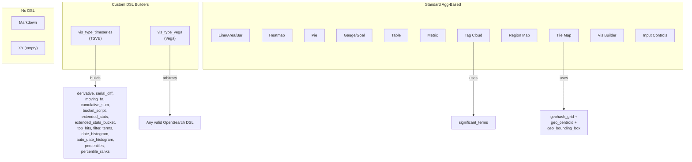

# OpenSearch Dashboards: Visualization Plugin → DSL Feature Mapping

## Executive Summary

This document maps every visualization plugin in OpenSearch Dashboards to the specific OpenSearch Query DSL features it uses. There are two architectural patterns:

1. **Standard Agg-Based Visualizations** — Use the shared `data` plugin's agg framework (`vis_default_editor` schemas). The schemas declare which metric/bucket aggs are allowed via `aggFilter` allowlists/denylists.
2. **Custom DSL Builders** — TSVB (`vis_type_timeseries`) and Vega (`vis_type_vega`) construct their own query DSL server-side or client-side.

---

## Data Plugin: Shared Aggregation Framework

All standard visualizations use agg types registered in `src/plugins/data/common/search/aggs/agg_types.ts`:

### Metric Aggregations
| Agg Type | DSL Name |
|---|---|
| count | `value_count` (implicit `_count`) |
| avg | `avg` |
| sum | `sum` |
| median | `percentiles` (50th) |
| min | `min` |
| max | `max` |
| std_dev | `extended_stats` |
| cardinality | `cardinality` |
| percentiles | `percentiles` |
| percentile_ranks | `percentile_ranks` |
| top_hits | `top_hits` |
| derivative | `derivative` (pipeline) |
| cumulative_sum | `cumulative_sum` (pipeline) |
| moving_fn | `moving_fn` (pipeline) |
| serial_diff | `serial_diff` (pipeline) |
| avg_bucket | `avg_bucket` (sibling pipeline) |
| sum_bucket | `sum_bucket` (sibling pipeline) |
| min_bucket | `min_bucket` (sibling pipeline) |
| max_bucket | `max_bucket` (sibling pipeline) |
| geo_bounds | `geo_bounds` |
| geo_centroid | `geo_centroid` |

### Bucket Aggregations
| Agg Type | DSL Name |
|---|---|
| date_histogram | `date_histogram` |
| histogram | `histogram` |
| range | `range` |
| date_range | `date_range` |
| ip_range | `ip_range` |
| terms | `terms` |
| filter | `filter` |
| filters | `filters` |
| significant_terms | `significant_terms` |
| geohash_grid | `geohash_grid` |
| geotile_grid | `geotile_grid` |

---

## 1. vis_type_timeseries (TSVB) — CUSTOM DSL BUILDER

**Path**: `src/plugins/vis_type_timeseries/`
**Architecture**: Builds its own query DSL server-side via request processors pipeline.
**Panel types**: timeseries, metric, top_n, gauge, markdown, table

### Direct DSL Construction (bucket_transform.js)

| TSVB Metric | DSL Produced | Notes |
|---|---|---|
| `count` | `bucket_script` with `_count` | Uses expression lang script |
| `static` | `bucket_script` | Painless script with static value |
| `avg`, `max`, `min`, `sum` | `avg`, `max`, `min`, `sum` | Standard metric aggs |
| `cardinality` | `cardinality` | Standard |
| `value_count` | `value_count` | Standard |
| `sum_of_squares`, `variance`, `std_deviation` | `extended_stats` | With optional `sigma` param |
| `top_hit` | `filter` + `top_hits` | Wraps in exists filter, supports sort |
| `percentile` | `percentiles` | With percents array, supports bands |
| `percentile_rank` | `percentile_ranks` | With values array |
| `derivative` | `derivative` | Pipeline agg with `gap_policy`, `unit` |
| `serial_diff` | `serial_diff` | Pipeline agg with `lag`, `gap_policy` |
| `cumulative_sum` | `cumulative_sum` | Pipeline agg |
| `moving_average` | `moving_fn` | Uses `MovingFunctions.*` scripts |
| `calculation` | `bucket_script` | Painless script with variables, `_interval` param |
| `positive_only` | `bucket_script` | Painless: `params.value > 0.0 ? params.value : 0.0` |
| `avg_bucket`, `max_bucket`, `min_bucket`, `sum_bucket` | `extended_stats_bucket` | Sibling pipeline aggs |
| `sum_of_squares_bucket`, `std_deviation_bucket`, `variance_bucket` | `extended_stats_bucket` | Sibling pipeline with sigma |
| `filter_ratio` | `filter` + `bucket_script` | Numerator/denominator filters with ratio script |
| `positive_rate` | `max` + `derivative` + `bucket_script` | Composite: max → derivative → positive_only |

### Moving Average Models (moving_fn_scripts.js)
| Model | Script |
|---|---|
| simple (unweighted) | `MovingFunctions.unweightedAvg(values)` |
| ewma | `MovingFunctions.ewma(values, alpha)` |
| holt | `MovingFunctions.holt(values, alpha, beta)` |
| holt_winters | `MovingFunctions.holtWinters(values, alpha, beta, gamma, period, multiplicative)` |
| linear | `MovingFunctions.linearWeightedAvg(values)` |

### Request Processors Pipeline
| Processor | DSL Features |
|---|---|
| `query` | `bool` query with `must` (range filter, panel filter, series filter), uses `opensearchQuery.buildOpenSearchQuery()` |
| `splitByTerms` | `terms` agg with `size`, `include`, `exclude`, `order` |
| `splitByFilter` | `filter` agg via `buildOpenSearchQuery()` |
| `splitByFilters` | `filters` agg via `buildOpenSearchQuery()` |
| `splitByEverything` | `filter` with `match_all` |
| `dateHistogram` | `date_histogram` with `extended_bounds`, `time_zone`, OR `auto_date_histogram` |
| `metricBuckets` | All non-sibling metric aggs from bucket_transform |
| `siblingBuckets` | All `*_bucket` sibling pipeline aggs |
| `filterRatios` | `filter` (numerator/denominator) + `bucket_script` (division) |
| `positiveRate` | `max` + `derivative` + `bucket_script` (positive_only) |
| `normalizeQuery` | Removes empty agg objects |

### Annotations
| Processor | DSL Features |
|---|---|
| `query` | `bool` query with range filter |
| `dateHistogram` | `date_histogram` |
| `topHits` | `top_hits` with `sort`, `_source.includes` |

### Script Languages Used
- **Painless**: `bucket_script` (calculation, static, positive_only, filter_ratio)
- **Expression**: `bucket_script` (count)
- **MovingFunctions**: `moving_fn` scripts

### Query Features
- `bool` query construction via `opensearchQuery.buildOpenSearchQuery()`
- `range` filter on time field
- `match_all` for split-by-everything
- `exists` filter (top_hit)
- Dashboard context filters injection
- Time offset support

---

## 2. vis_type_vislib — Line, Area, Bar, Heatmap, Pie, Gauge, Goal

**Path**: `src/plugins/vis_type_vislib/`
**Architecture**: Standard agg-based via `vis_default_editor` schemas.

### Line Chart (`line.ts`)
| Schema | Group | Allowed Aggs |
|---|---|---|
| metric (Y-axis) | Metrics | All except `!geo_centroid`, `!geo_bounds` |
| radius (Dot size) | Metrics | `count`, `avg`, `sum`, `min`, `max`, `cardinality`, `top_hits` |
| segment (X-axis) | Buckets | All except `!geohash_grid`, `!geotile_grid`, `!filter` |
| group (Split series) | Buckets | All except `!geohash_grid`, `!geotile_grid`, `!filter` |
| split (Split chart) | Buckets | All except `!geohash_grid`, `!geotile_grid`, `!filter` |

### Area Chart (`area.ts`)
Same schema as Line chart. Metric allows all except `!geo_centroid`, `!geo_bounds`. Radius limited to `count`, `avg`, `sum`, `min`, `max`, `cardinality`.

### Histogram / Vertical Bar (`histogram.ts`)
Same schema as Line/Area. Metric allows all except `!geo_centroid`, `!geo_bounds`.

### Horizontal Bar (`horizontal_bar.ts`)
Same schema as Histogram.

### Heatmap (`heatmap.ts`)
| Schema | Group | Allowed Aggs |
|---|---|---|
| metric (Value) | Metrics | `count`, `avg`, `median`, `sum`, `min`, `max`, `cardinality`, `std_dev`, `top_hits` |
| segment (X-axis) | Buckets | All except `!geohash_grid`, `!geotile_grid`, `!filter` |
| group (Y-axis) | Buckets | All except `!geohash_grid`, `!geotile_grid`, `!filter` |
| split (Split chart) | Buckets | All except `!geohash_grid`, `!geotile_grid`, `!filter` |

### Pie Chart (`pie.ts`)
| Schema | Group | Allowed Aggs |
|---|---|---|
| metric (Slice size) | Metrics | `sum`, `count`, `cardinality`, `top_hits` |
| segment (Split slices) | Buckets | All except `!geohash_grid`, `!geotile_grid`, `!filter` |
| split (Split chart) | Buckets | All except `!geohash_grid`, `!geotile_grid`, `!filter` |

### Gauge (`gauge.ts`)
| Schema | Group | Allowed Aggs |
|---|---|---|
| metric | Metrics | All except `!std_dev`, `!geo_centroid`, `!percentiles`, `!percentile_ranks`, `!derivative`, `!serial_diff`, `!moving_avg`, `!cumulative_sum`, `!geo_bounds` |
| group (Split group) | Buckets | All except `!geohash_grid`, `!geotile_grid`, `!filter` |

### Goal (`goal.ts`)
Same schema as Gauge.

---

## 3. vis_type_table — Data Tables

**Path**: `src/plugins/vis_type_table/`

| Schema | Group | Allowed Aggs |
|---|---|---|
| metric | Metrics | All except `!geo_centroid`, `!geo_bounds`. `top_hits` allows strings. |
| bucket (Split rows) | Buckets | All except `!filter` |
| split (Split table) | Buckets | All except `!filter` |

**Note**: Allows `significant_terms`, `geohash_grid`, `geotile_grid` in bucket schemas (only `!filter` excluded).

---

## 4. vis_type_metric — Metric Visualization

**Path**: `src/plugins/vis_type_metric/`

| Schema | Group | Allowed Aggs |
|---|---|---|
| metric | Metrics | All except `!std_dev`, `!geo_centroid`, `!derivative`, `!serial_diff`, `!moving_avg`, `!cumulative_sum`, `!geo_bounds`. `top_hits` allows strings. |
| group (Split group) | Buckets | All except `!geohash_grid`, `!geotile_grid`, `!filter` |

---

## 5. vis_type_tagcloud — Tag Cloud

**Path**: `src/plugins/vis_type_tagcloud/`

| Schema | Group | Allowed Aggs |
|---|---|---|
| metric (Tag size) | Metrics | All except `!std_dev`, `!percentiles`, `!percentile_ranks`, `!derivative`, `!geo_bounds`, `!geo_centroid` |
| segment (Tags) | Buckets | **Only** `terms`, `significant_terms` |

**Key**: This is the only standard visualization that explicitly uses `significant_terms`.

---

## 6. vis_type_vega — Vega Visualizations (CUSTOM DSL)

**Path**: `src/plugins/vis_type_vega/`
**Architecture**: User writes arbitrary OpenSearch DSL in Vega/Vega-Lite spec JSON.

### DSL Construction (opensearch_query_parser.ts)
- **Arbitrary query DSL**: Users write any valid OpenSearch query in `url.body`
- **Context variables**: `%timefilter%`, `%context%`, `%timefield%`, `%autointerval%`
- **Dashboard filters**: `%dashboard_context-must_clause%`, `%dashboard_context-must_not_clause%`, `%dashboard_context-filter_clause%`
- **Time range injection**: Creates `range` filter with `gte`/`lte`/`format: strict_date_optional_time`
- **Auto-interval**: Calculates `date_histogram` interval from time range
- **PPL support**: Via `PPLQueryParser` for PPL query language

### Supported DSL Features
- **Any valid OpenSearch query/aggregation** — no restrictions
- `bool` query with `must`, `must_not`, `filter`
- Any metric, bucket, or pipeline aggregation
- `_msearch` multi-search support
- Custom `body.aggs`, `body.query`
- Time shift with `shift`/`unit` parameters

### Query Features
- `opensearchDashboardsAddFilter` — programmatic filter creation from Vega signals
- Full dashboard context integration
- Data source support (multi-cluster)

---

## 7. vis_type_xy — XY Charts

**Path**: `src/plugins/vis_type_xy/`
**Status**: Plugin is registered but **empty** — no vis type definitions are actually registered. The `visTypeDefinitions` and `visFunctions` arrays are empty. This is a placeholder/experimental plugin.

---

## 8. vis_builder — Visual Builder

**Path**: `src/plugins/vis_builder/`
**Architecture**: Standard agg-based, mirrors vis_type_vislib/metric/table schemas.

### Registered Visualization Types

#### Metric (vis_builder)
Same agg filters as `vis_type_metric`: excludes `!std_dev`, `!geo_centroid`, `!derivative`, `!serial_diff`, `!moving_avg`, `!cumulative_sum`, `!geo_bounds`.

#### Table (vis_builder)
Same as `vis_type_table`: metric excludes `!geo_centroid`, `!geo_bounds`; buckets exclude `!filter`.

#### Line (vis_builder)
Same as `vis_type_vislib` line: metric excludes `!geo_centroid`, `!geo_bounds`; buckets exclude `!geohash_grid`, `!geotile_grid`, `!filter`, `!filters`.

#### Area (vis_builder)
Same as vislib area.

#### Histogram (vis_builder)
Same as vislib histogram.

#### Pie (vis_builder)
Metric: `sum`, `count`, `cardinality`, `top_hits`. Buckets: exclude `!geohash_grid`, `!geotile_grid`, `!filter`.

---

## 9. vis_type_markdown — Markdown Visualization

**Path**: `src/plugins/vis_type_markdown/`
**DSL Usage**: **None**. Pure client-side rendering of user-provided markdown text. No aggregations, no queries.

---

## 10. vis_default_editor — Aggregation Editor UI

**Path**: `src/plugins/vis_default_editor/`
**Role**: Provides the `Schemas` class and agg parameter editors used by all standard visualizations.

### Key DSL-Related Features
- `aggFilter` system: allowlist/denylist patterns for agg types per schema
- Pipeline agg validation: ensures parent pipeline aggs have valid bucket aggs
- `termsAggFilter`: special filter for terms agg order-by metric selection (excludes `!top_hits`, `!percentiles`, `!percentile_ranks`, `!median`, `!std_dev`)
- `is_filtered_by_collar` control: `geo_bounding_box` filter for geohash_grid aggs
- Supports all metric types from data plugin's `METRIC_TYPES` and `BUCKET_TYPES`

---

## 11. input_control_vis — Input Controls

**Path**: `src/plugins/input_control_vis/`
**Architecture**: Custom DSL construction via `SearchSource`.

### List Control (list_control_factory.ts)
| DSL Feature | Details |
|---|---|
| `terms` agg | With `size`, `order._count`, `include` (regex for dynamic filtering) |
| Scripted fields | `script` + `value_type` for scripted fields |
| `SearchSource` | Sets `filter`, `size: 0`, `index`, `aggs` |
| Time filter | Optional `timefilter.createFilter()` |
| Phrase filters | Ancestor chain filtering |

### Range Control (range_control_factory.ts)
| DSL Feature | Details |
|---|---|
| `min` agg | On field or scripted field |
| `max` agg | On field or scripted field |
| Scripted fields | `script` + `lang` support |
| `SearchSource` | Sets `filter`, `size: 0`, `index`, `aggs` |

---

## 12. region_map — Region Maps

**Path**: `src/plugins/region_map/`

| Schema | Group | Allowed Aggs |
|---|---|---|
| metric (Value) | Metrics | `count`, `avg`, `sum`, `min`, `max`, `cardinality`, `top_hits`, `sum_bucket`, `min_bucket`, `max_bucket`, `avg_bucket` |
| segment (Shape field) | Buckets | **Only** `terms` |

**Geo Features**: Uses GeoJSON vector layers for rendering but does NOT use geo aggregations. Joins data to shapes via terms agg on a join field.

---

## 13. tile_map — Coordinate Maps (Geo)

**Path**: `src/plugins/tile_map/`

| Schema | Group | Allowed Aggs |
|---|---|---|
| metric (Value) | Metrics | `count`, `avg`, `sum`, `min`, `max`, `cardinality`, `top_hits` |
| segment (Geo coordinates) | Buckets | **Only** `geohash_grid` |

### Geo-Specific Features
| Feature | Details |
|---|---|
| `geohash_grid` bucket agg | Primary bucket agg — required |
| `geo_centroid` metric agg | Used via `convertToGeoJson` for marker placement |
| `geo_bounding_box` filter | Applied via `is_filtered_by_collar` to limit query to map viewport |
| Geohash precision | Zoom-level to geohash precision mapping |
| Map types | Scaled circles, Shaded circles, Shaded geohash grid, Heatmap |

---

## 14. maps_legacy — Legacy Maps Support

**Path**: `src/plugins/maps_legacy/`
**Role**: Shared library for tile_map and region_map. Not a visualization itself.

### Geo Features Provided
| Feature | Details |
|---|---|
| `convertToGeoJson()` | Converts tabified response with `geohash`, `geocentroid`, `metric` dimensions to GeoJSON |
| `decodeGeoHash()` | Decodes geohash strings to lat/lon rectangles |
| Geohash precision mapping | Maps zoom levels to geohash precision |
| `geohashColumns()` | Calculates world-wide column count for precision level |
| `geo_bounding_box` collar | Viewport-based filtering support |

---

## Summary: DSL Feature Usage Matrix

### Aggregation Type → Visualization Mapping

| DSL Aggregation | Visualizations That Use It |
|---|---|
| `avg` | All standard (line, area, bar, heatmap, pie, table, metric, tagcloud, region_map, tile_map, gauge, goal, vis_builder), TSVB |
| `sum` | All standard, TSVB |
| `min` | All standard, TSVB, input_control_vis (range) |
| `max` | All standard, TSVB, input_control_vis (range) |
| `count` | All standard, TSVB |
| `cardinality` | All standard, TSVB |
| `value_count` | TSVB |
| `extended_stats` | Line/area/bar (std_dev), heatmap (std_dev), table, TSVB |
| `percentiles` | Line/area/bar, table, TSVB |
| `percentile_ranks` | Line/area/bar, table, TSVB |
| `top_hits` | All standard (most), TSVB |
| `median` | Line/area/bar, heatmap, table |
| `derivative` | Line/area/bar, table, TSVB |
| `cumulative_sum` | Line/area/bar, table, TSVB |
| `moving_fn` | Line/area/bar, table, TSVB |
| `serial_diff` | Line/area/bar, table, TSVB |
| `avg_bucket` | Line/area/bar, table, region_map, TSVB |
| `sum_bucket` | Line/area/bar, table, region_map, TSVB |
| `min_bucket` | Line/area/bar, table, region_map, TSVB |
| `max_bucket` | Line/area/bar, table, region_map, TSVB |
| `date_histogram` | All bucket-capable standard vis, TSVB |
| `auto_date_histogram` | TSVB (entire timerange mode) |
| `histogram` | All bucket-capable standard vis |
| `terms` | All bucket-capable standard vis, TSVB, input_control_vis |
| `significant_terms` | Tag cloud, table |
| `filters` | Line/area/bar, table, TSVB |
| `filter` | TSVB (filter_ratio, split_by_filter) |
| `range` | Line/area/bar, table |
| `date_range` | Line/area/bar, table |
| `ip_range` | Line/area/bar, table |
| `geohash_grid` | Tile map (required) |
| `geotile_grid` | (Available in data plugin, not used by any built-in vis) |
| `geo_bounds` | (Available in data plugin, used by tile_map internally) |
| `geo_centroid` | Tile map (via convertToGeoJson) |
| `geo_bounding_box` (filter) | Tile map (viewport collar filter) |
| `bucket_script` | TSVB (count, static, calculation, positive_only, filter_ratio, positive_rate) |
| `extended_stats_bucket` | TSVB (sibling pipeline aggs) |

### Script Usage

| Script Type | Used By |
|---|---|
| Painless (`bucket_script`) | TSVB (calculation, static, positive_only) |
| Expression lang (`bucket_script`) | TSVB (count) |
| MovingFunctions (`moving_fn`) | TSVB (ewma, holt, holt_winters, linear, unweighted) |
| Scripted fields | Input controls (terms agg, min/max agg) |

### Query Features

| Query Feature | Used By |
|---|---|
| `bool` query | All (via data plugin's `buildOpenSearchQuery`), TSVB, Vega |
| `range` filter (time) | All time-aware vis, TSVB, Vega |
| `match_all` | TSVB (split_by_everything) |
| `exists` filter | TSVB (top_hit) |
| `geo_bounding_box` filter | Tile map |
| Dashboard context filters | All standard vis, TSVB, Vega |
| `%timefilter%` / `%autointerval%` | Vega |
| PPL queries | Vega |
